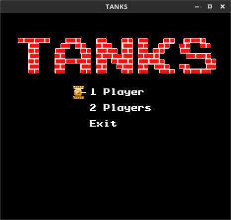
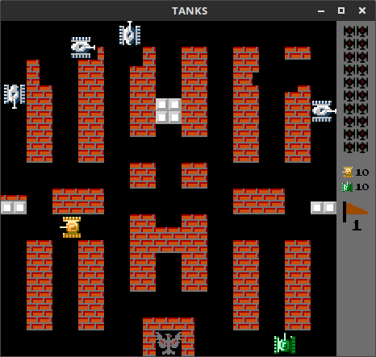

# Tank 1990 (Battle City Clone)

Jogo de tanques inspirado no clássico Battle City (Tank 1990), desenvolvido em C++11 utilizando a biblioteca SDL2 para gráficos 2D. Permite jogar sozinho, em dupla ou até quatro jogadores (com controles). O projeto é modular, fácil de compilar e extensível.




## Sumário
- [Tank 1990 (Battle City Clone)](#tank-1990-battle-city-clone)
  - [Sumário](#sumário)
  - [Descrição](#descrição)
  - [Estrutura do Código](#estrutura-do-código)
  - [Controles](#controles)
    - [Jogadores](#jogadores)
    - [Teclas Globais](#teclas-globais)
  - [Inimigos](#inimigos)
  - [Bônus](#bônus)
  - [Fases e Mapas](#fases-e-mapas)
  - [Compilação e Execução](#compilação-e-execução)
    - [Linux](#linux)
    - [Mac](#mac)
    - [Windows](#windows)
  - [Créditos e Contribuição](#créditos-e-contribuição)
  - [Dicas de Depuração](#dicas-de-depuração)

---

## Descrição

Clone fiel do clássico Battle City/Tank 1990, com suporte a múltiplos jogadores, IA de inimigos, power-ups, física de gelo, destruição de cenário e sistema de fases. O código é organizado em módulos para facilitar manutenção e expansão.

## Estrutura do Código

- `src/engine/` — Motor de renderização, sprites e lógica de física
- `src/app_state/` — Estados da aplicação: menu, jogo, placar
- `src/objects/` — Objetos do jogo: tanques, inimigos, projéteis, bônus, cenário
- `src/app.cpp`/`app.h` — Ciclo principal da aplicação (main loop)
- `src/appconfig.cpp`/`appconfig.h` — Configurações globais e parâmetros do jogo
- `resources/` — Imagens, fontes, fases e DLLs (Windows)

## Controles

### Jogadores
- **Jogador 1:** Controle (gamepad) 0
- **Jogador 2:** Controle (gamepad) 1
- **Jogador 3:** Controle (gamepad) 2
- **Jogador 4:** Teclado (WASD para mover, Espaço para atirar)

> *Nota: Em Macbooks, o disparo pode ser adaptado para a tecla Alt caso não haja Ctrl direito.*

### Teclas Globais
- **Pause:** ENTER
- **Próxima fase:** N
- **Fase anterior:** B
- **Mostrar alvo dos inimigos (debug):** T
- **Sair/Voltar ao menu:** ESC

## Inimigos

Cada inimigo pode disparar apenas um projétil por vez. Existem quatro tipos de inimigos, cada um com cor, armadura e comportamento distintos:

- **A:** Persegue o jogador ou águia, velocidade normal, comportamento 80% alvo/20% aleatório
- **B:** Persegue a águia, 30% mais rápido, comportamento 50% alvo/50% aleatório
- **C:** Persegue a águia, velocidade normal, comportamento 50% alvo/50% aleatório
- **D:** Persegue o jogador ou águia, velocidade normal, comportamento 50% alvo/50% aleatório, só atira se o alvo está à frente

Inimigos piscando ao serem atingidos podem gerar bônus.

## Bônus

-  **Granada:** destrói todos os inimigos visíveis
-  **Capacete:** escudo temporário (10s)
-  **Relógio:** congela inimigos (8s)
-  **Pá:** cria muralha de pedra ao redor da águia (15s)
-  **Tanque:** +1 vida
-  **Estrela:** aumenta velocidade e projéteis
-  **Arma:** maximiza upgrades
-  **Barco:** permite atravessar água

## Fases e Mapas

Os mapas estão em `resources/levels/` e são arquivos texto 26x26:
- `.`: vazio
- `#`: parede de tijolo (destrutível)
- `@`: pedra (só destrói com upgrades máximos)
- `%`: arbusto (destrutível com upgrades máximos)
- `~`: água (só atravessa com barco)
- `-`: gelo (tanques escorregam)

## Compilação e Execução

### Linux
**Requisitos:**
- make
- libsdl2-dev
- libsdl2-ttf-dev
- libsdl2-image-dev

Instale com:
```sh
sudo apt install libsdl2-dev libsdl2-ttf-dev libsdl2-image-dev
```
Compile e execute:
```sh
make clean all
cd build/bin && ./Tanks
```

### Mac
**Requisitos:**
- make
- sdl2, sdl2_ttf, sdl2_image (via Homebrew)

Instale com:
```sh
brew install sdl2 sdl2_ttf sdl2_image
```
Compile e execute:
```sh
make clean all
cd build/bin && ./Tanks
```

### Windows
**Requisitos:**
- MinGW (g++)
- Variável MINGW_HOME configurada
- Git Bash ou similar

Compile e execute:
```sh
mingw32-make.exe clean all
cd build/bin && ./Tanks.exe
```

> **Atenção:** Execute SEMPRE a partir do diretório `build/bin` para garantir que os recursos sejam encontrados.

## Créditos e Contribuição

- Código original: Krystian Kałużny
- Adaptação, engenharia reversa e documentação: [Gabryel-lima]
- SDL2: https://www.libsdl.org/

Contribuições são bem-vindas! Para sugerir melhorias, abra um *pull request* ou *issue*.

## Dicas de Depuração

- Para inspecionar variáveis críticas, adicione `printf` ou use breakpoints em funções de atualização de estado (ex: `Player::update`, `Game::update`).
- Comandos básicos GDB:
  - `break main` — para no início
  - `break NomeDaFuncao` — para em função específica
  - `run` — inicia o programa
  - `next`/`step` — avança linha a linha
  - `print variavel` — imprime valor
  - `backtrace` — mostra pilha de chamadas
- Para ver o alvo dos inimigos em tempo real, pressione `T` durante o jogo.

---

Divirta-se e sinta-se à vontade para modificar e expandir o projeto!
